  

# 🗺️ Awesome Mapping & Navigation 📍

  
  
  
  
  

> **A curated, SEO-optimized list of top SaaS mapping solutions, open-source routing engines, geocoders, GIS tools, and interactive map rendering libraries.**

---

## 💡 Overview & Ecosystem

Welcome to **Awesome Mapping & Navigation**! 🚗📍 This repository brings together the best **commercial SaaS platforms** and **open-source developer tools** for building location-aware applications, turn-by-turn navigation systems, spatial analytics, geocoding workflows, and interactive map UI components.

Whether you're an enterprise developer comparing **Google Maps Platform** API pricing, an open-source enthusiast building offline navigation with **OsmAnd** and **OpenStreetMap**, or a GIS analyst leveraging **QGIS** and **Valhalla**, this list provides structured insights, free tier limits, licensing, and direct GitHub links.

---

## 📖 Table of Contents 📑

- [☁️ SaaS / Hosted Mapping Platforms](#%EF%B8%8F-saas--hosted-mapping-platforms)
- [🔓 Open-Source Mapping & Navigation Projects](#-open-source-mapping--navigation-projects)
- [🤝 How to Contribute](#-how-to-contribute)
- [💖 Support & Sponsorship](#-support--sponsorship)
- [⚠️ Disclaimer](#%EF%B8%8F-disclaimer)
- [⭐ Star History](#-star-history)

---

## ☁️ SaaS / Hosted Mapping Platforms

> **📊 Market Context**: The global mapping and navigation market is estimated at **~$15B in 2026**, growing toward **~$35B by 2032**. The sector is **highly concentrated** (winner-take-all dynamics dominated by Google and Apple in consumer mobile, and Google Maps Platform / HERE in developer APIs). **Pricing varies dramatically**: **Google Maps Platform** offers a **$200 monthly credit** (e.g. 28,000 dynamic map loads or 40,000 direction calls/month) and three main subscription tiers — **Starter at $100/month for 50,000 calls**, **Essentials at $275/month for 100,000 calls**, and **Pro at $1,200/month for 250,000 calls**. **Apple Maps**, **Waze**, and **HERE WeGo** are **100% free** to end users. **MapQuest** offers a developer free tier of **15,000 transactions/month** with paid tiers starting at **$99/month**. **TomTom GO** offers a **30-day free trial**, then **£19.99/year** for car navigation. **Windows Maps** is **freeware** bundled with Windows.

| Platform | Description | Pricing (Starting Tier) | Free Tier Limits | Company Size |
|----------|-------------|------------------------|------------------|--------------|
| **[Apple Maps](https://www.apple.com/maps/)** 🍏 | **Apple's native mapping app.** Privacy-focused navigation with Look Around, detailed city experiences, and EV routing. | **Free** — bundled with Apple devices | **Unlimited** — free for all Apple device users | **~$400B revenue (Apple FY2025 est.)** |
| **[Google Maps](https://maps.google.com/)** 🗺️ | **The dominant mapping and navigation platform.** Consumer app plus developer APIs for maps, routes, places, and environment. | **Starter plan**: **$100/month** (50,000 calls); Essentials: $275/mo; Pro: $1,200/mo | **$200 monthly credit** (up to 28,000 dynamic map loads or 40,000 direction calls/month) | **~$350B revenue (Alphabet FY2025)** |
| **[Waze](https://www.waze.com/)** 🚘 | **Community-driven navigation.** Real-time traffic, police alerts, and crowd-sourced road reports. | **Free** — 100% free community navigation | **Unlimited** — free for all users | **Part of Google (~$350B revenue)** |
| **[Windows Maps](https://www.microsoft.com/en-us/p/windows-maps/9wzdncrfj3tj)** 🪟 | **Microsoft's native Windows mapping app.** Voice navigation, turn-by-turn directions, and Ink support. | **Freeware** — bundled with Windows | **Unlimited** — free with Windows OS | **~$281B revenue (Microsoft FY2025)** |
| **[HERE WeGo](https://www.here.com/)** 📍 | **Free navigation app from HERE Technologies.** Offline maps, public transit in 1,900+ cities, and turn-by-turn voice guidance. | **Free** — no cost to consumer users | **Unlimited** — free for all consumer app users | **~$3.1B valuation (€2.8B automotive consortium acquisition)** |
| **[MapQuest](https://www.mapquest.com/)** 🎯 | **Long-standing mapping and navigation service.** Turn-by-turn directions and route planning APIs. | **Developer Starter**: **$99/month** (ad-free consumer app option: $1.99–$4.99/month) | **15,000 transactions/month** free developer tier | **Private (System1)** |
| **[TomTom GO](https://www.tomtom.com/)** 🚗 | **Premium navigation app.** Real-time traffic, speed camera alerts, and offline maps. | **Car plan**: **£19.99/year** (or £3.99/month) | **30-day free trial** with full navigation features | **~$580M revenue (€530M FY2025)** |

---

## 🔓 Open-Source Mapping & Navigation Projects

Below is a sorted list of leading open-source repositories for interactive web maps, routing engines, geocoding tools, and desktop GIS suites, ordered by GitHub star count (descending).

| Project / Repo | Description | Stars |
|----------------|-------------|-------|
| **[Leaflet](https://github.com/Leaflet/Leaflet)** 🍃 | **The leading open-source JavaScript library for mobile-friendly interactive maps.** Lightweight, highly extensible with thousands of plugins. **BSD-2-Clause**. |  |
| **[CesiumJS](https://github.com/CesiumGS/cesium)** 🌐 | **An open-source JavaScript library for world-class 3D globes and maps.** High-performance 3D geospatial visualization for web applications. **Apache-2.0**. |  |
| **[QGIS](https://github.com/qgis/QGIS)** 🗺️ | **The industry-standard open-source Desktop Geographic Information System (GIS).** Create, edit, visualize, analyze, and publish geospatial data. **GPL-2.0**. |  |
| **[MapLibre GL JS](https://github.com/maplibre/maplibre-gl-js)** 🎨 | **Open-source fork of Mapbox GL JS.** WebGL-accelerated vector map rendering with zero mandatory vendor lock-in. **BSD-3-Clause**. |  |
| **[OSRM](https://github.com/Project-OSRM/osrm-backend)** ⚡ | **Open Source Routing Machine (OSRM).** High-performance C++ routing engine designed to run on OpenStreetMap data. **BSD-2-Clause**. |  |
| **[GraphHopper](https://github.com/graphhopper/graphhopper)** 🦘 | **Fast and memory-efficient Java routing engine.** Turn-by-turn routing for cars, bicycles, and pedestrians with OpenStreetMap integration. **Apache-2.0**. |  |
| **[OsmAnd](https://github.com/osmandapp/OsmAnd)** 📱 | **Full-featured offline navigation application for Android & iOS.** Voice directions, offline vector maps, and lane guidance powered by OpenStreetMap. **GPL-3.0**. |  |
| **[Valhalla](https://github.com/valhalla/valhalla)** 🛡️ | **Open-source multi-modal routing engine.** Features dynamic costing, transit integration, map matching, and elevation query APIs. **MIT**. |  |
| **[OpenStreetMap Website](https://github.com/openstreetmap/openstreetmap-website)** 🌍 | **The core web portal for the world's largest open geographic database.** ODbL licensed dataset powered by millions of volunteer mappers. **GPL-2.0**. |  |
| **[Nominatim](https://github.com/osm-search/Nominatim)** 🔍 | **Open-source geocoding and reverse geocoding engine for OpenStreetMap.** Search location names, addresses, and geographic boundaries. **GPL-2.0**. |  |
| **[OpenMapTiles](https://github.com/openmaptiles/openmaptiles)** 🧱 | **Set of open-source tools for self-hosting vector map tiles from OpenStreetMap.** Custom map design and offline tile generation. **BSD-3-Clause / CC-BY**. |  |
| **[MapLibre Native](https://github.com/maplibre/maplibre-native)** 📲 | **Open-source native SDK for rendering vector maps in iOS, Android, and Desktop applications.** **BSD-2-Clause**. |  |
| **[Photon](https://github.com/komoot/photon)** 🚀 | **Open-source geocoder for OpenStreetMap data powered by Elasticsearch.** Fast search autocomplete and multi-lingual support. **Apache-2.0**. |  |

---

## 🤝 How to Contribute 🛠️

Contributions to **Awesome Mapping & Navigation** are warmly welcomed! Help us keep this resource up to date and comprehensive:

1. **Fork** the repository.
2. Add your suggested SaaS product or open-source tool to `README.md` following the table formatting.
3. Ensure open-source entries include valid GitHub links, descriptions, license, and star badges.
4. Open a **Pull Request** with a brief summary of why the addition is valuable.

Check out our full awesome ecosystem collection on [Awesome-Awesome-Awesome](https://github.com/ishandutta2007/Awesome-Awesome-Awesome)!

---

## 💖 Support & Sponsorship ☕

If you found this repository helpful for your projects, research, or developer stack, please consider supporting the project!

- ⭐ **Star** this repository to increase visibility.
- 🔄 **Share** it with your network, team, or GIS communities.
- ☕ **Sponsor / Buy Me a Coffee**: Support ongoing open-source maintenance on the [GitHub Sponsor Dashboard](https://github.com/sponsors/ishandutta2007).

Thank you for being part of the open geospatial community! ❤️

---

## ⚠️ Disclaimer 📜

- This list is **community-curated** for educational and informational purposes — it is non-exhaustive and does not constitute formal software endorsement.
- Mapping, routing, and location services handle sensitive geographic and user location data. Developers must ensure compliance with regional privacy laws (GDPR, CCPA, etc.).
- **OpenStreetMap Attribution**: When using OSM data or services derived from it, you must credit OpenStreetMap (`© OpenStreetMap contributors`) under the **ODbL license**.

---

## ⭐ Star History

---

  Made with ❤️ for developers, GIS professionals, urban planners, and navigation enthusiasts worldwide.

